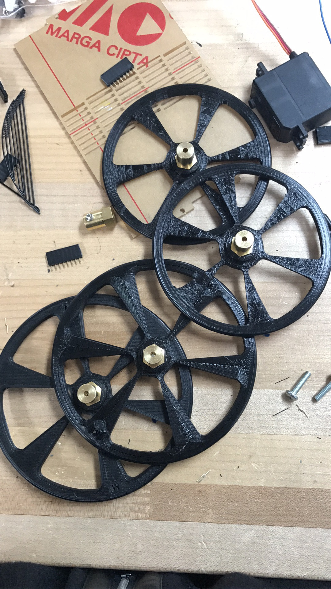
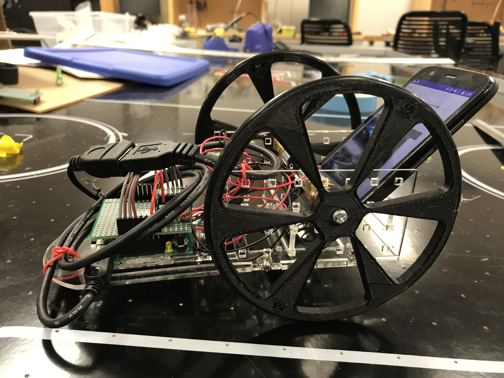

# Mengjiao_ME433_2017
Repository for ME 433 Advanced Mechatronics assignments and projects

Course Source: https://github.com/ndm736/ME433_2017/wiki

## HW1

HW1 assignment description [here](https://github.com/ndm736/ME433_2017/wiki/HW1). My homework folder [here](https://github.com/MuMu1018/Mengjiao_ME433_2017/tree/master/HW1).

This is my breadboard PIC32 circuit:

Test demo: a blinking LED (at 1 kHz), that stops when pushing and holding the USER pushbutton, and continues when releasings.

## HW2

HW2 assignment description [here](https://github.com/ndm736/ME433_2017/wiki/HW2). My homework folder [here](https://github.com/MuMu1018/Mengjiao_ME433_2017/tree/master/HW2).

This homework is the first half of [HW3](https://github.com/ndm736/ME433_2017/wiki/HW3). We use [Sparkfun Eagle Github libraries](https://github.com/sparkfun/SparkFun-Eagle-Libraries) to create our own libraries.

## HW3

HW3 assignment description [here](https://github.com/ndm736/ME433_2017/wiki/HW3). My homework folder [here](https://github.com/MuMu1018/Mengjiao_ME433_2017/tree/master/HW3).

We create a PCB of our PIC32 circuit, 5cm x 5cm, with header pins at specific locations. Do all of the error checking, generate the Gerber files. This is my design:

## HW4 - SPI DAC

HW4 assignment description [here](https://github.com/ndm736/ME433_2017/wiki/HW4). My homework folder [here](https://github.com/MuMu1018/Mengjiao_ME433_2017/tree/master/HW4).

Here's a schematic showing the connections between our PIC32 and this particular DAC ([the MCP4902](https://github.com/ndm736/ME433_2017/blob/master/mcp4902_spi-dac.pdf)) using SPI communication. The DAC outputs on pins V_OUTA (14) and V_OUTB (10).

The DAC outputs:

10Hz sine wave on VoutA + 5Hz triangle wave on VoutB:

10Hz sine wave on VoutA + 10Hz triangle wave on VoutB:

## HW5 - I2C pin expander

HW5 assignment description [here](https://github.com/ndm736/ME433_2017/wiki/HW5). My homework folder [here](https://github.com/MuMu1018/Mengjiao_ME433_2017/tree/master/HW5).

Here's a schematic showing the connections between our PIC32 and the MCP23008 I/O expander ([datasheet for MCP23008](https://github.com/ndm736/ME433_2017/blob/master/mcp23008_i2c-expander.pdf)) using I2C communication.

## HW6 - LCD printing

HW6 assignment description [here](https://github.com/ndm736/ME433_2017/wiki/HW6). My homework folder [here](https://github.com/MuMu1018/Mengjiao_ME433_2017/tree/master/HW6).

## HW7 - LCD control with IMU

Control the flowing bar on LCD screen by rotating LSM6DS33 breakout board, with I2C connection.

HW7 assignment description [here](https://github.com/ndm736/ME433_2017/wiki/HW7). My homework folder [here](https://github.com/MuMu1018/Mengjiao_ME433_2017/tree/master/HW7).

## HW8 - recreate HW7 project in MPLABX 

Use harmony to create a project for the PIC in MPLABX. 

HW8 assignment description [here](https://github.com/ndm736/ME433_2017/wiki/HW8). My homework folder [here](https://github.com/MuMu1018/Mengjiao_ME433_2017/tree/master/HW8).

## HW9 - USB communication between the PIC & PC

HW9 assignment description [here](https://github.com/ndm736/ME433_2017/wiki/HW9). My homework folder [here](https://github.com/MuMu1018/Mengjiao_ME433_2017/tree/master/HW9).

## HW10 - IIR, MAF and FIR low-pass filters

HW10 assignment description [here](https://github.com/ndm736/ME433_2017/wiki/HW10). My homework folder [here](https://github.com/MuMu1018/Mengjiao_ME433_2017/tree/master/HW10).

From the records, I find that IIR is better for tracking, while MAF and FIR filters are better in reducing noises.

## Final project

Final project assignment description [here](https://github.com/ndm736/ME433_2017/wiki/HW20). My Android code is in [this](https://github.com/MuMu1018/Mengjiao_ME433_2017/tree/master/HW20) folder.

Car body design using **SolidWorks**, **3D printer** and **laser cutting**:

+ Bracket:

+ Wheels:

+ Whole car:

